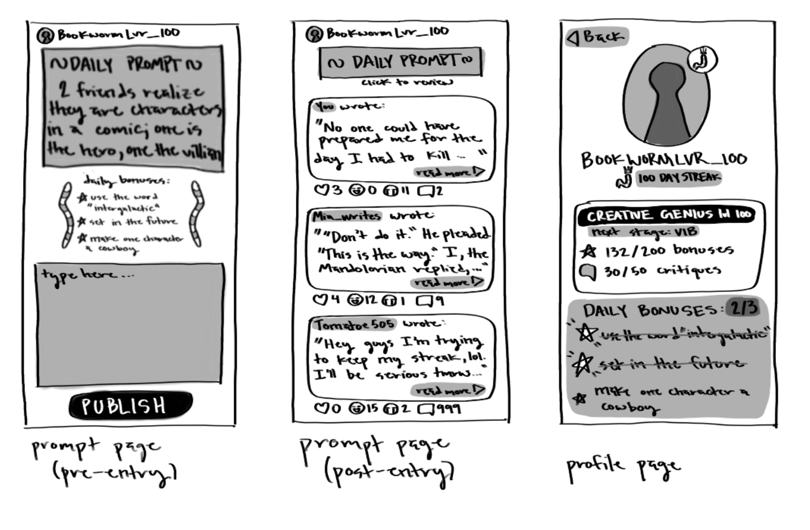
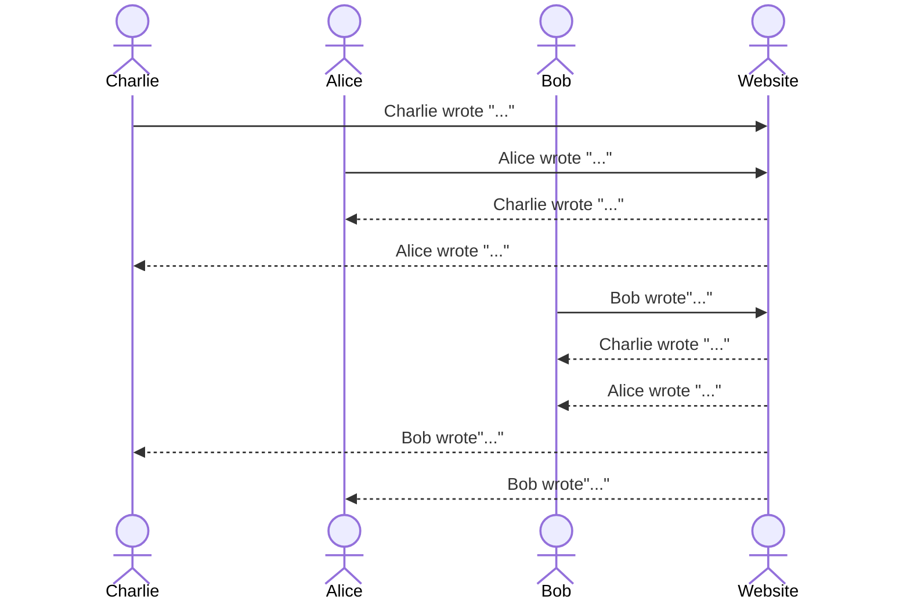
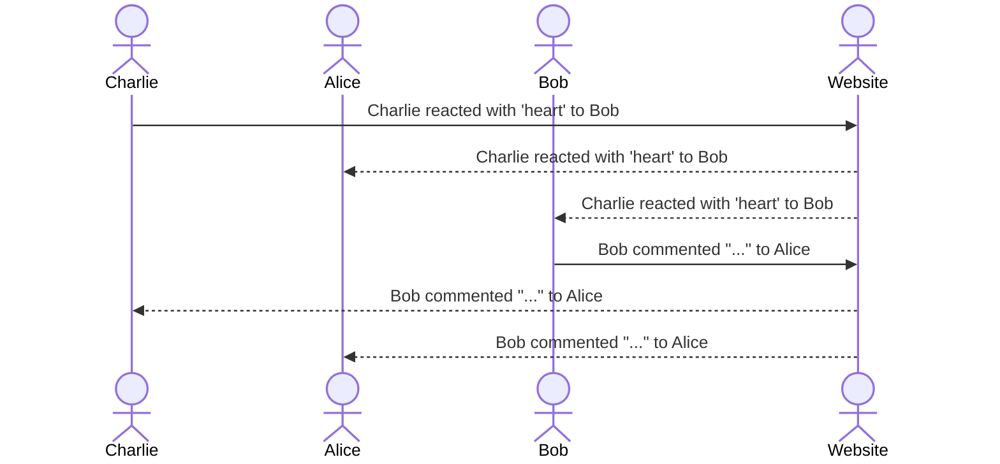

# Bookworms

[My Notes](notes.md)

A daily prompt application to encourage creative writing and beat writers block!

## 🚀 Specification Deliverable

For this deliverable I did the following. I checked the box `[x]` and added a description for things I completed.

- [x] Proper use of Markdown
- [x] A concise and compelling elevator pitch
- [x] Description of key features
- [x] Description of how you will use each technology
- [x] One or more rough sketches of your application. Images must be embedded in this file using Markdown image references.

### Elevator pitch

This application is the cure to writer's block! Bookworms supplies a daily creative writing prompt to help you build a habit of practicing writing daily. What's more, you can find inspiration in friend's responses to the same prompt but with their own spin. Each user can increase their author score by keeping up a daily streak and completing randomized daily achievements unique to them. These acheivements ensure that each prompt response has it's own spin with takes including using a specific word, exceeding a certain word count, writing in different tenses, and more! As reponses pile up, you can connect with your friends by leaving reactions and comments to encourage originality, creativity, and excellence among your very own group of bookworms. 

### Design

Here is the skeleton design concept for the three main pages of the application: the prompt page before publishing, the prompt page after publishing, and the profile page accessed by clicking the profile name at the top of the prompt page. 

Here is the sequence diagram for publishing prompt responses. As each user publishes, all friend responses previously published become visible, and their feed updates with each new response. 

This sequence diagram maps friend interactions after publishing. Each reaction and comment is visible to the response author and their friends.

### Key features

- Secure login over HTTPS
- Ability to publish a response
- Display of friends' responses
- Ability to react to other responses
- Past prompt repsponses stored in profile
- Personalized daily bonuses to encourage diversity in responses

### Technologies

I am going to use the required technologies in the following ways.

- **HTML** - Uses correct HTML structure and organization. There are are four Four HTML pages. One respectively for login, prompt publishing and interaction, profile management, and friend management. Hyperlinks exist to connect the artifacts. 
- **CSS** - Uses CSS for aethetic styling that looks good on several screen sizes and orientations. It will use whitespace and color contrast properly to make app usage intuitive.
- **React** - React will be used to connect components for logging in, publishing responses, interacting with other responses, and opening profile management. 
- **Service** - The service with handle endpoints for:
    - logging in and out
    - publishing responses and interactions
    - retrieving friend responses and interactions
    - retrieving streak value
    - updating friends list
    - retrieving and updating author score
- **DB/Login** - The Database will store user authentification and profiles, previous prompt responses, author level, friends list, and daily bonus completion. 
- **WebSocket** - Websocket will handle real time updates, such as daily prompt responses and friend interactions. 

## 🚀 AWS deliverable

For this deliverable I did the following. I checked the box `[x]` and added a description for things I completed.

- [ ] **Server deployed and accessible with custom domain name** - [My server link](https://yourdomainnamehere.click).

## 🚀 HTML deliverable

For this deliverable I did the following. I checked the box `[x]` and added a description for things I completed.

- [ ] **HTML pages** - I did not complete this part of the deliverable.
- [ ] **Proper HTML element usage** - I did not complete this part of the deliverable.
- [ ] **Links** - I did not complete this part of the deliverable.
- [ ] **Text** - I did not complete this part of the deliverable.
- [ ] **3rd party API placeholder** - I did not complete this part of the deliverable.
- [ ] **Images** - I did not complete this part of the deliverable.
- [ ] **Login placeholder** - I did not complete this part of the deliverable.
- [ ] **DB data placeholder** - I did not complete this part of the deliverable.
- [ ] **WebSocket placeholder** - I did not complete this part of the deliverable.

## 🚀 CSS deliverable

For this deliverable I did the following. I checked the box `[x]` and added a description for things I completed.

- [ ] **Visually appealing colors and layout. No overflowing elements.** - I did not complete this part of the deliverable.
- [ ] **Use of a CSS framework** - I did not complete this part of the deliverable.
- [ ] **All visual elements styled using CSS** - I did not complete this part of the deliverable.
- [ ] **Responsive to window resizing using flexbox and/or grid display** - I did not complete this part of the deliverable.
- [ ] **Use of a imported font** - I did not complete this part of the deliverable.
- [ ] **Use of different types of selectors including element, class, ID, and pseudo selectors** - I did not complete this part of the deliverable.

## 🚀 React part 1: Routing deliverable

For this deliverable I did the following. I checked the box `[x]` and added a description for things I completed.

- [ ] **Bundled using Vite** - I did not complete this part of the deliverable.
- [ ] **Components** - I did not complete this part of the deliverable.
- [ ] **Router** - I did not complete this part of the deliverable.

## 🚀 React part 2: Reactivity deliverable

For this deliverable I did the following. I checked the box `[x]` and added a description for things I completed.

- [ ] **All functionality implemented or mocked out** - I did not complete this part of the deliverable.
- [ ] **Hooks** - I did not complete this part of the deliverable.

## 🚀 Service deliverable

For this deliverable I did the following. I checked the box `[x]` and added a description for things I completed.

- [ ] **Node.js/Express HTTP service** - I did not complete this part of the deliverable.
- [ ] **Static middleware for frontend** - I did not complete this part of the deliverable.
- [ ] **Calls to third party endpoints** - I did not complete this part of the deliverable.
- [ ] **Backend service endpoints** - I did not complete this part of the deliverable.
- [ ] **Frontend calls service endpoints** - I did not complete this part of the deliverable.
- [ ] **Supports registration, login, logout, and restricted endpoint** - I did not complete this part of the deliverable.

## 🚀 DB deliverable

For this deliverable I did the following. I checked the box `[x]` and added a description for things I completed.

- [ ] **Stores data in MongoDB** - I did not complete this part of the deliverable.
- [ ] **Stores credentials in MongoDB** - I did not complete this part of the deliverable.

## 🚀 WebSocket deliverable

For this deliverable I did the following. I checked the box `[x]` and added a description for things I completed.

- [ ] **Backend listens for WebSocket connection** - I did not complete this part of the deliverable.
- [ ] **Frontend makes WebSocket connection** - I did not complete this part of the deliverable.
- [ ] **Data sent over WebSocket connection** - I did not complete this part of the deliverable.
- [ ] **WebSocket data displayed** - I did not complete this part of the deliverable.
- [ ] **Application is fully functional** - I did not complete this part of the deliverable.
